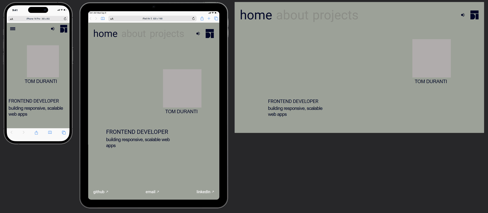

# My website

### Project

This is V1 of my website showcasing the best works and other information. It was built with a minimalist and brutalist style in mind and the design is completely original.
  
### Built with

- React 18 & Vite
- React Router v6
- MUI
- Semantic HTML5
- Responsive & adaptive design
- Mobile-first workflow
- Cross-browser compatibility (Chrome, Edge, Safari, Opera, Firefox)

### Screenshot (live site: [tomduranti.com](https://tomduranti.com))

### Highlights

- Light/Dark mode toggle
- Indexed on Google
- SEO-optimized meta tags via react-helmet-async

### Further enhancements

Multilingual support for it, de, ru.
