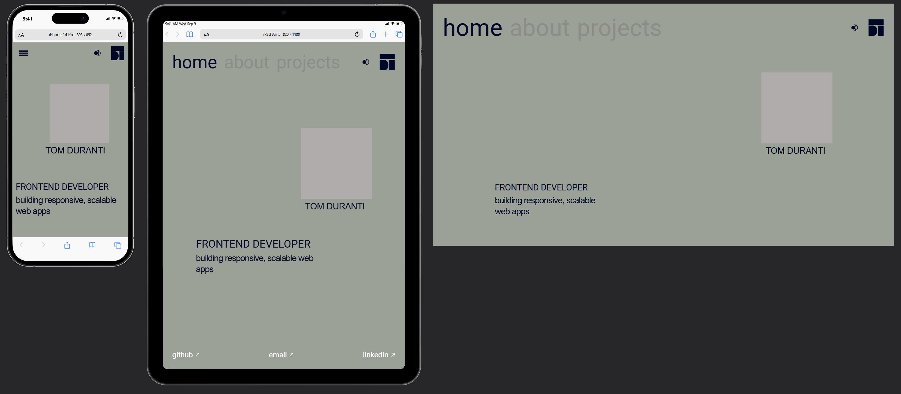

# My website

### Project

This is V1 of my website showcasing the best works and other information. It was built with a minimalist and brutalist style in mind and the design is completely original.
  
### Built with

- React 18 & Vite
- React Router v6
- MUI
- Semantic HTML5
- Responsive & adaptive design
- Mobile-first workflow
- Cross-browser compatibility (Chrome, Edge, Safari, Opera, Firefox)

### Screenshot (live site: [tomduranti.com](https://tomduranti.com))

### Highlights

- Light/Dark mode toggle
- SEO-optimized meta tags via react-helmet-async. This makes up for the poor SEO friendliness of CSR (or at least it tries to). I am considering using React Router (framework mode) to mimic SSR.

## Changelog
All notable changes to this project will be documented in this file. The format is based on [Keep a Changelog](https://keepachangelog.com/en/1.1.0/), and this project adheres to [Semantic Versioning](https://semver.org/).

#### [v1.0.1] – [06/10/2026]

- multilingual support for it-IT

#### [v1.0.0] – [26/09/2026]

- home, about, and projects pages 
- light/dark mode toggle
- puppetter to mock SSR for indexing the website on google search

## Roadmap

#### [v1.0.2] -- Unreleased

- multilingual support for ru-RU